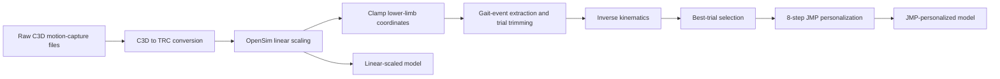

## Overview

This repository contains the code and configuration files developed for a Bachelor Thesis focused on **subject-specific musculoskeletal (MSK) model personalization** using the **Joint Model Personalization (JMP)** module of the **Neuromusculoskeletal Modeling (NMSM) Pipeline**.

The work compares conventional **OpenSim linear scaling** with **JMP-based joint-level personalization** in:

- 12 able-bodied adults
- 12 age- and sex-matched stroke survivors

The workflow starts from full-body motion-capture data and covers the complete preparation process required before JMP: C3D-to-TRC conversion, marker relabeling, model scaling, joint-coordinate clamping, gait-event-based trial trimming, inverse kinematics, trial selection, and the eight-step JMP configuration.

> **Important:** this is **not** the official NMSM Pipeline repository. It contains thesis-specific scripts, setup files, and configurations built on top of the NMSM Pipeline.  
> Official NMSM Pipeline code: https://github.com/rcnl-org/nmsm-core

---

## Research objective

The main objective was to assess whether joint-level personalization improves the ability of a musculoskeletal model to reproduce subject-specific motion compared with conventional linear scaling, and whether this benefit differs between able-bodied adults and stroke survivors.

The personalized models were evaluated primarily using **root-mean-square (RMS) marker-tracking error**, with additional analysis of personalization-induced changes in hip, knee, and ankle kinematics.

---

## Workflow



The main stages correspond to Chapter 4 of the thesis:

1. **Data preprocessing**
   - C3D-to-TRC conversion
   - Plug-in Gait (PiG) to RCNL2025 marker relabeling
   - Sacral marker construction when required
   - Coordinate-system transformation
   - Walking-direction normalization

2. **Linear scaling**
   - OpenSim `ModelScaler`
   - OpenSim `MarkerPlacer`
   - Subject-specific static-trial time windows

3. **Coordinate clamping**
   - Forces selected lower-limb OpenSim coordinates to respect their valid ranges before inverse kinematics

4. **Gait-event extraction and trimming**
   - Reads heel-strike events from C3D files
   - Aligns C3D and TRC time bases
   - Restricts dynamic trials to the steady-state walking interval

5. **Inverse kinematics**
   - Runs IK for all candidate walking trials
   - Uses population-specific marker task sets for able-bodied and stroke participants

6. **Best-trial selection**
   - Applies gait-event and joint-ROM quality filters
   - Uses marker-tracking RMS error as the main ranking criterion
   - Treats gait asymmetry differently in able-bodied and stroke participants

7. **Joint Model Personalization**
   - Eight sequential JMP steps, progressing from proximal to distal regions
   - Lower limb personalized first, followed by torso and upper limb

8. **Evaluation**
   - Linear scaling vs. JMP marker-tracking error
   - Global, regional, and individual-marker analyses
   - Joint-kinematic comparison before and after personalization

---

## Repository structure

The repository is organized according to the methodological stages of the thesis.

```text
1_Preprocessing_for_JMP/
│
├── 1_Scaled_model_(.osim)/
│   ├── 1_C3D_to_TRC/
│   ├── 2_Scaling/
│   │   ├── SUBJXX/
│   │   └── TVCXX/
│   └── 3_Clamp_angles/
│
├── 2_IK_(.mot)/
│   ├── Able-bodied/
│   └── Stroke/
│
└── 3_JMP_settings_(.xml)/
    ├── SUBJXX/
    │   └── Walk_X/
    └── TVCXX/
        └── Walk_X/
```

`SUBJXX` denotes an able-bodied participant, `TVCXX` a stroke survivor, and `Walk_X` the selected walking trial.

### Main scripts and configuration files

| Thesis stage | Main files | Purpose |
|---|---|---|
| Preprocessing | `C3D_to_TRC_RCNL2025_forceSacral.m` | Converts C3D marker trajectories to RCNL2025-compatible TRC files |
| Scaling | Subject-specific scaling XML files | Configures OpenSim ModelScaler and MarkerPlacer |
| Coordinate clamping | `ApplyCampedFixAll.m`, `fixClampedOsim.m` | Forces selected lower-limb coordinates to remain within valid model ranges |
| Gait trimming | `generate_gait_trim_windows.py` | Extracts heel-strike events and generates steady-state gait windows |
| Inverse kinematics | `generateIKSetup.m`, `Batch_Able_IK_xml.m`, `Batch_Stroke_IK_xml.m` | Generates IK setup files and batch-runs IK |
| Trial selection | `select_best_trial.py` | Selects the most suitable walking trial for JMP |
| JMP | Eight XML setup files per selected subject/trial | Defines the sequential JMP personalization procedure |

The eight JMP configuration stages are:

1. Pelvis/thigh marker adjustment
2. Knee/ankle joint personalization
3. Lower-limb body and marker personalization
4. Ankle-axis personalization
5. Torso marker adjustment
6. Shoulder/elbow joint personalization
7. Upper-limb body and marker personalization
8. Wrist-axis personalization

---

## Software requirements

The thesis workflow was developed and tested with:

- **OpenSim 4.5**
- **NMSM Pipeline v1.5.3**
- **MATLAB R2025b**
- **Python**
- **ezc3d**

The following MATLAB toolboxes are required by the NMSM Model Personalization workflow:

- Optimization Toolbox
- Parallel Computing Toolbox
- Statistics and Machine Learning Toolbox
- Curve Fitting Toolbox
- Symbolic Math Toolbox
- Signal Processing Toolbox

The **OpenSim MATLAB API** must also be correctly configured so that MATLAB can load and manipulate OpenSim models.

Useful resources:

- OpenSim: https://opensim.stanford.edu/
- NMSM Pipeline: https://github.com/rcnl-org/nmsm-core
- NMSM documentation: https://rcnl-org.github.io/nmsm-core/

For the Python preprocessing stage:

```bash
pip install ezc3d
```

---

## Dataset

The motion-capture data used in this work come from the open-access dataset:

> Van Criekinge, T. et al. **A full-body motion capture gait dataset of 138 able-bodied adults across the life span and 50 stroke survivors.** *Scientific Data* 10, 852 (2023).

Article:  
https://www.nature.com/articles/s41597-023-02767-y

The dataset contains full-body C3D motion-capture recordings from able-bodied adults and stroke survivors collected using the same experimental infrastructure and protocol.

This repository provides the **processing and personalization workflow** developed for the thesis. Obtain the original motion-capture data from the dataset authors/data repository before attempting to reproduce the complete workflow.

---

## Running the workflow

There is no single end-to-end command. The repository mirrors the sequence used during the thesis, and the stages should be run in order.

### 1. Prepare the motion-capture data

Run the C3D-to-TRC preprocessing script on the original dataset files:

```text
C3D_to_TRC_RCNL2025_forceSacral.m
```

This stage converts the marker trajectories to OpenSim TRC format and maps the experimental PiG marker names to the RCNL2025 marker convention.

### 2. Scale the RCNL2025 model

Use the subject-specific OpenSim scaling XML files with the corresponding static trial to generate a linearly scaled `.osim` model.

### 3. Apply the clamped-coordinate fix

Run the MATLAB clamping utilities on the scaled model before inverse kinematics.

### 4. Generate gait-trim windows

Run:

```bash
python generate_gait_trim_windows.py
```

This creates the steady-state gait windows used by the IK stage.

### 5. Run inverse kinematics

Use the MATLAB IK function and the corresponding able-bodied or stroke batch script.

The generated setup files update the trial-specific:

- `time_range`
- `marker_file`
- `output_motion_file`

while preserving the corresponding IK task set.

### 6. Select the best walking trial

Run:

```bash
python select_best_trial.py
```

The selected trial is then used as the motion target for JMP.

### 7. Run the eight JMP stages

Run the eight JMP XML configurations sequentially for the selected subject/trial. Each stage uses the output of the previous stage as its starting model.

### 8. Evaluate the personalized model

Compare the linearly scaled and final JMP-personalized models using marker-tracking RMS error and, where required, joint-kinematic outputs.

> Paths in MATLAB, Python, and XML configuration files may need to be adapted to your local OpenSim, NMSM Pipeline, dataset, and repository locations.